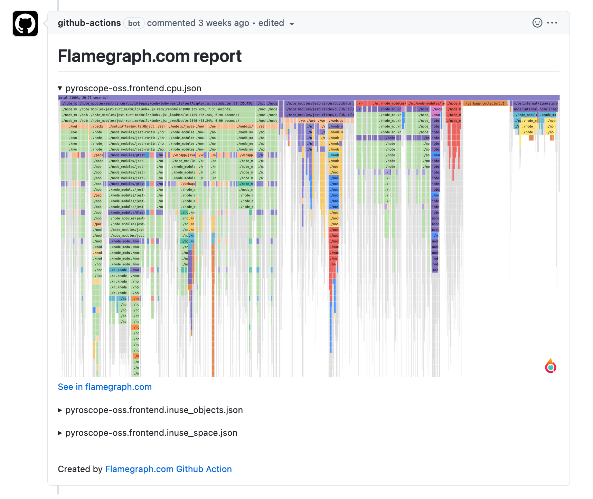

# CI Profiling with Pyroscope


Profiling today looks _very_ different than it did just a few years ago. As people move to more cloud-native workloads 
continuous profiling has evolved into a key piece of many companies' observability suites. At Pyroscope, we've been a huge
part of this evolution thanks to an ever-expanding community who has provided great insight into the use cases where profiling
is most valuable and how we can continue to improve that experience. 

As a result, over the past few years we've released several products to help developers improve their applications' performance. 
1. **Continuous Profiling**: Our most popular a tool for continuously profiling your applications accross your entire system and then
storing and querying that data efficiently

2. **Adhoc Profiling**: In cases where you may not need to _constantly_ profile or perhaps you'd like to save a snapshot of a profile,
our adhoc tool allows you to both capture and save specific profiles to later refer to or use for your convenience

3. **Profiling Exemplars**: Profiles linked to particular meaningful units such as HTTP requests or trace spans

## Introducing CI Profiling
Now, we're excited to announce the latest addition to the Pyroscope family - CI Profiling. Continuous Integration and Delivery (CI/CD) pipelines are critical for modern software development, but they can also be a 
source of frustration and inefficiency. Waiting for long test runs, dealing with frequent failures and timeouts, and wasting 
resources are all common problems associated with CI/CD pipelines. These issues can be compounded when multiple developers 
are working on the same codebase or when teams are working across multiple repositories. That's why we've developed this new feature that can help: 

**Continuous Profiling with Pyroscope in your CI/CD pipelines.**

<!--truncate-->

## How CI Profiling with Pyroscope Solves Common CI/CD Pipeline Problems

<center>
</img>
</center>

- **Improved Performance:** Profiling your code as part of your CI/CD pipeline can help you identify performance bottlenecks and optimize your code for improved performance, leading to faster builds, faster deployments, and more efficient use of resources.
- **Faster Test Execution:** With CI Profiling, you can identify slow tests and optimize them for faster execution, reducing the amount of time spent waiting for tests to complete and increasing the speed at which you can iterate on your code.
- **Less Test Failures and Timeouts:** By identifying performance bottlenecks in your code, you can reduce the number of test failures and timeouts that occur as part of your CI/CD pipeline, making your pipeline more reliable and consistent.
- **Better Resource Utilization:** Profiling your code can help optimize resource usage and reduce waste by identifying code that is using too much CPU or memory, allowing you to make targeted optimizations to improve the overall efficiency of your code.
- **Early Issue Detection:** Profiling your code as part of your CI/CD pipeline can help with early issue detection, allowing you to catch newly introduced code regressions or performance issues before they impact your users.
- **Improved Collaboration:** Sharing profiling results can lead to better understanding of the codebase and how it can be optimized for improved performance, leading to better collaboration and more efficient use of resources across your organization.


## How to Add Profiling to your CI/CD Pipeline

While we currently support profiling test suites in Node, Go, and Ruby is coming soon (see [docs](/docs/ci)) for this blog post we will just describe from a high level the steps for profiling
a test suite in any language, but using Node as an example. Over time we plan to add support for other langauges / frameworks as well. 

### Add Profiling via Test Config

To add profiling to your CI/CD pipeline, you'll need to configure your test suite to include the Pyroscope profiler.
Here's an example of how to do this with jest in Node:

```js
// jest.config.js
module.exports = {
  // ...
  globalSetup: '<rootDir>/globalSetup.js',
  globalTeardown: '<rootDir>/globalTeardown.js',
  // ...
}
```
### Add a Global "Setup" / "Teardown" Step
Once you've added profiling to your test configuration, you'll need to add a global "setup" or "teardown" step to
initialize and then remove the profiler. Here's an example of how to do this in jest.

```js
// Setup in globalSetup.js
const Pyroscope = require('@pyroscope/nodejs');

module.exports = () => {
  Pyroscope.init({
    serverAddress: '_',
    appName: 'myapp.frontend',
  });
  if (process.env.CI) {
    Pyroscope.startCpuProfiling();
  }
};


// Teardown in globalTeardown.js
const Pyroscope = require('@pyroscope/nodejs');

module.exports = (config) => {
  if (process.env.CI) {
    Pyroscope.stopCpuProfiling();
    Pyroscope.stopHeapProfiling();
  }
};
```

### Add a GitHub Workflow

Finally, you'll need to add a GitHub workflow to run your tests with profiling as part of your CI/CD pipeline.
Here's an example of how to do this in a GitHub workflow file:

```yaml
name: CI Profiling

on:
  push:
    branches: [main]
  pull_request:
    branches: [main]

jobs:
  js-tests:
    runs-on: ubuntu-latest
    steps:
      - name: Checkout
        uses: actions/checkout@v2
      - uses: actions/setup-node@v2
        with:
          node-version: '16.18'
      - name: Install pyroscope-ci
        uses: jaxxstorm/action-install-gh-release@v1.5.0
        with: # Grab the latest version
          repo: pyroscope-io/ci
        env:
          GITHUB_TOKEN: ${{ secrets.GITHUB_TOKEN }}
      - name: Install Webapp dependencies
        run: yarn install --frozen-lockfile
      - name: Run tests and upload
        run: pyroscope-ci exec --apiKey=${{ secrets.PYROSCOPE_CLOUD_TOKEN }} yarn test --no-cache --max-workers=1
```

### View results in PR body

Being able to view flamegraphs for test results in the PR body enables quick identification of performance bottlenecks, improves collaboration, helps catch issues early, and leads to a better understanding of the codebase.

[](https://github.com/pyroscope-io/pyroscope/pull/1847#issuecomment-1424338623)

### View results in Pyroscope UI

Viewing results in the Pyroscope UI allows for you to see how your test suit has performed over time and understand where regressions where introduced (or improvements were made). 
The Pyroscope UI also makes it easy to view the flamegraph diff between branches, prs, commits or any individual test runs. 


## CI/CD Profiling in Action: Saving 70% on test run time

In this section, we'll explore how we were able to significantly improve the performance of our test suite by ~70% leveraging
Pyroscope's CI/CD Profiling feature. By profiling our code as part of our CI/CD pipeline, we identified an unknown inefficiency
in our Jest test suite that was slowing down our builds. Specifically, we discovered that a significant amount of time was being
spent on code transformation via `ts-jest`.

To address this issue, we decided to migrate from `ts-jest` to `swc`, a modern JavaScript/TypeScript compiler written in Rust that is
known for its fast performance. By doing so, we were able to significantly reduce the amount of time spent on code transformation
during our test runs, leading to faster build times and more efficient use of resources. In this section, we'll dive into the details
of how we made this optimization and the results we achieved.

### Improving CPU Performance: Replacing `ts-jest` with `swc`
Before we delve into the specifics of our optimization efforts, let's first provide some background on two libraries `ts-jest` and `swc`.

#### The problem with `ts-jest`
In our efforts to optimize the performance of our test suite, we decided to explore alternatives to `ts-jest`, the popular tool used for
testing TypeScript code with Jest. While `ts-jest` allows developers to run their tests with type checking enabled, it can also lead to
significant performance overhead. Specifically, this overhead comes from the fact that running type checking during test runs can slow
down the test execution time, leading to longer build times and potentially wasting resources. 

Through our profiling efforts with Pyroscope, we were able to identify this performance bottleneck and look for ways to address it.

#### Rust-based `swc` as a solution
As an alternative, we turned to `swc`, a modern JavaScript/TypeScript compiler written in Rust that is known for its fast performance.
Compared to other compilers, including TypeScript's own compiler, `swc` leverages parallelization and other optimization techniques to achieve
faster performance. By migrating from `ts-jest` to `swc`, we were able to significantly reduce the amount of time spent on code transformation
during our test runs, leading to faster build times and more efficient use of resources.

In the following sections, we'll dive into the details of how we made this optimization and the results we achieved.


#### The cost of Typescript transformations
Our initial profiling efforts with Pyroscope revealed that most of the time spent in our test suite was on TypeScript
transformations via `ts-jest` (and consequently TypeScript). This high cost is due to `ts-jest` allowing for typechecking
during test runs. While this feature can help catch potential errors early in the development process, it can also significantly
slow down the test execution time, leading to longer build times and potentially wasting resources.

<iframe frameBorder="0" width="100%" height="400" src="https://flamegraph.com/share/3f5468c3-a882-11ed-8584-8eeab0f9bc97/iframe?colorMode=light&onlyDisplay=flamegraph"></iframe>
<a href="https://flamegraph.com/share/3f5468c3-a882-11ed-8584-8eeab0f9bc97">See in Flamegraph.com</a>

#### Cutting test run length in half with `tsc --no-emit` and `isolatedModules`
To address this issue, we decided to move type checking to its own separate step using `tsc --no-emit`. This allowed us to catch
potential errors during development, as our IDE already alerted us to these issues, and reduced the amount of time spent on type
checking during test runs. Additionally, we discovered that `ts-jest` 27.1 has an `isolatedModules` option that compiles each file individually,
effectively not doing type checking, further reducing the overhead of TypeScript transformations during test runs. More details on this option
can be found in the [official documentation](https://kulshekhar.github.io/ts-jest/docs/27.1/getting-started/options/isolatedModules/).

**This resulted in us cutting the test run from ~66 seconds to ~34 seconds!**

<iframe frameBorder="0" width="100%" height="400" src="https://flamegraph.com/share/57826b7a-a88b-11ed-a226-52d5adf2b04f/iframe?colorMode=light&onlyDisplay=flamegraph"></iframe>
<a href="https://flamegraph.com/share/57826b7a-a88b-11ed-a226-52d5adf2b04f">See in Flamegraph.com</a>

#### Cutting test run length in half, again, with `swc`

By switching to `swc` and making use of its parallelization and other optimization techniques, we were able to further cut down the test run
time *from around 34 seconds to approximately 19 seconds*, achieving massive gains compared to our original test suite run time.

<iframe frameBorder="0" width="100%" height="400" src="https://flamegraph.com/share/18b145d1-a895-11ed-97a4-2ee1108df414/iframe?colorMode=light&onlyDisplay=flamegraph"></iframe>
<a href="https://flamegraph.com/share/18b145d1-a895-11ed-97a4-2ee1108df414">See in Flamegraph.com</a>

#### The proof is in the PR

One of the best features of the new Pyroscope CI/CD Profiling feature is the ability to get profile reports in your PR with our Github Actions.
In this case, you can see from this [PR here](https://github.com/pyroscope-io/pyroscope/pull/1847) not only how the changes mentioned in this blog
post were implemented, but also how convenient it is to automatically get flamegraphs in your PR comments:

## How to add Pyroscope CI Profiling to your test suite

By using Pyroscope's CI Profiling, teams can collaborate better and optimize their resources across your ci/cd pipeline.
As displayed in this post, there's likely _some_ if not many low-hanging-fruit optimizations to make by simply addding Pyroscope's CI Profiling tool to your test suite. 

To learn more about how you can add profiling to your CI/CD suite, visit our [docs](/docs/ci). As always us know what you think!
